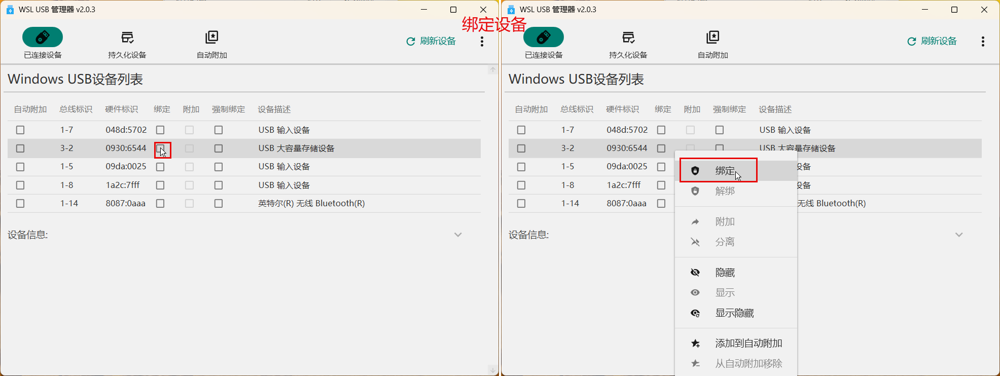
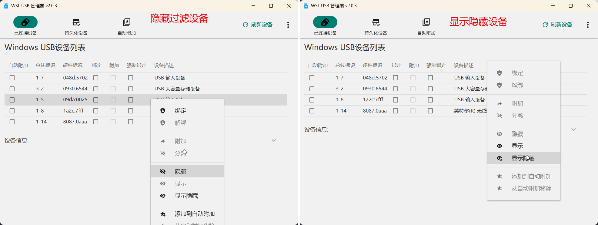
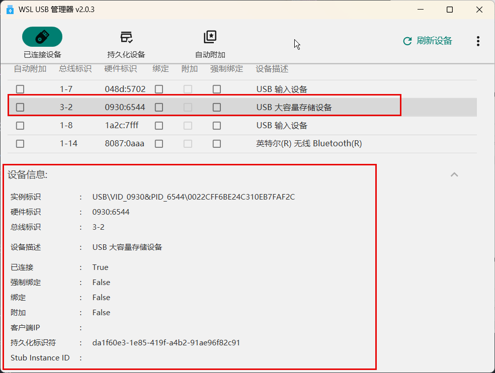
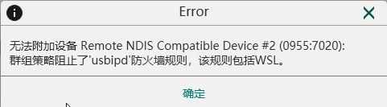
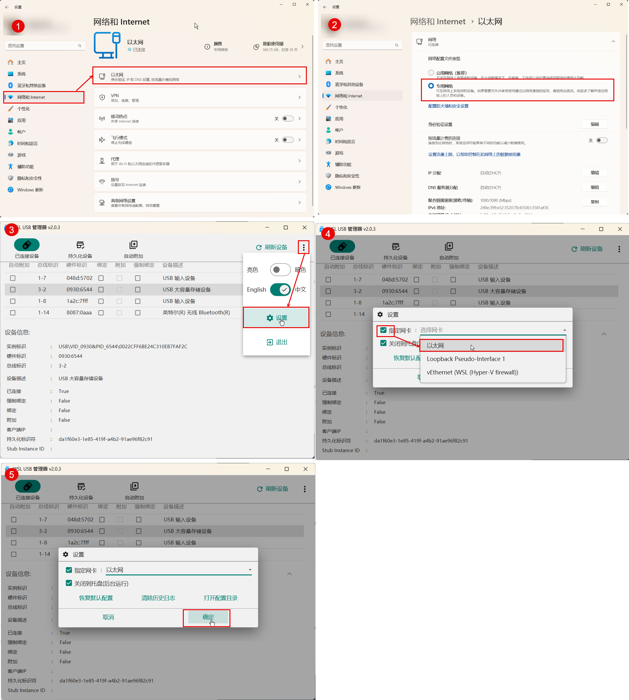
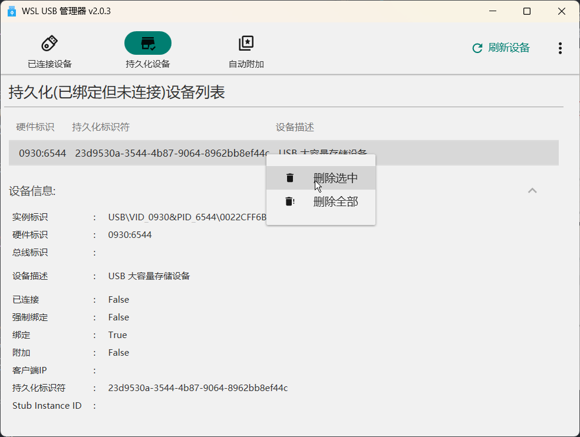
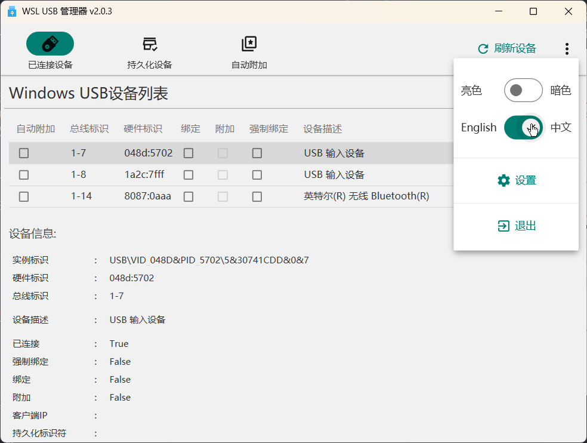
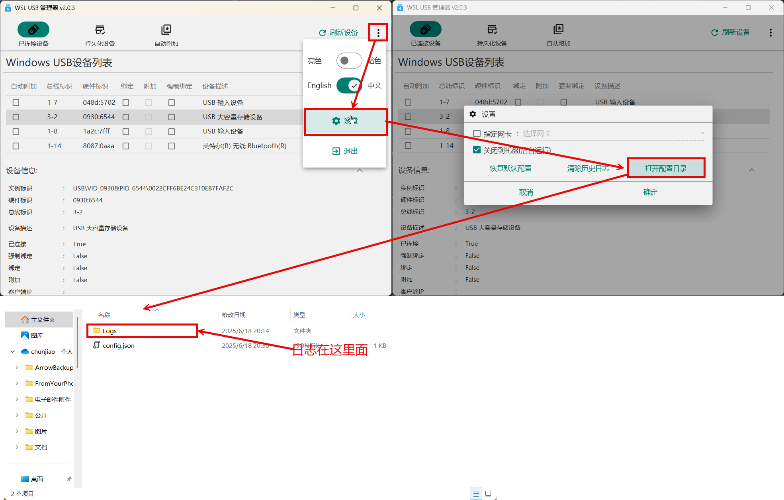

# wsl-usb-manager

#### 介绍

一款配合usbipd-win使用的用于附加USB设备到WSL中的工具，提供友好用户界面。

**功能**

1. 显示所有USB设备列表，可通过复选框或者右键菜单进行绑定/解绑设备、附加/分离设备等操作。

    >附加设备之前，必须先绑定设备。

    
    
    
    

2. 隐藏/显示过滤设备

    

3. 显示已选设备的详细信息

    

4. 支持通过指定网卡附加USB设备到WSL

   对于某些被组织域管控的windows，可能有特殊的防火墙配置，不允许WSL通过非私有网络访问host机上服务，这样导致设备无法被附加到WSL中，程序会报告类似下图中的错误：

   

   此时可以将设备上某个网络设置为私有网路，并且设置通过该网卡附加设备。**注意：请不要将非安全网络（例如公共场所的WiFi网络）设置为私有网络。**

   

5. 显示持久化的设备，可删除持久化设备

    持久化的设备是指已绑定但是未连接（没有接入到主机）的设备。
    usbipd-win每次绑定后都会记录绑定的设备，下次启动时自动绑定。
    这样可能会出现很多持久化的设备，本程序可以管理这些设备。

    

6. 支持自动检测USB设备插拔事件，自动刷新设备列表

7. 支持自动附件功能：设备添加到自动附加列表后，当设备插入时自动附加到WSL

    

8. 支持中英文

    

**运行需求**

1. Win10以上版本
2. .Net Framework 4.8环境
3. usbipd-win v4.4.0及其以上版本
4. WSL2环境，需要安装usbipd-win（须为）
5. 绑定设备时需要管理员权限

#### 构建

1.  安装Visual Studio 2022，同时安装如下扩展：

    - License Header Manager
    - Microsoft Visual Studio Installer Projects 2022
2.  安装Git
3.  安装Inno Setup 6（用于构建安装包）
4.  安装Git Version

    ```powershell
    dotnet tool install --global GitVersion.Tool
    ```

5.  构建

    ```powershell
    .\Build.ps1
    ```

    构建完成后，会在`BuildOutput\Installer`生成一个名为`WSL USB Manager Vx.x.x.exe `的安装包，其中`x.x.x`为当前版本号。


#### 报告bug

如果您在使用中遇到问题，请按照如下步骤打开日志路径，拷贝出最新日志，并在`issue`中提交bug同时附加日志。


