# WSL USB Manager

[中文](./README-zh)

#### Introduction

A GUI tool that works with usbipd-win to attach USB devices to WSL, providing a user-friendly interface.

**Features**

1. Displays all USB devices and lets you bind/unbind or attach/detach devices using checkboxes or the right-click menu.

    > Devices must be bound before they can be attached.

    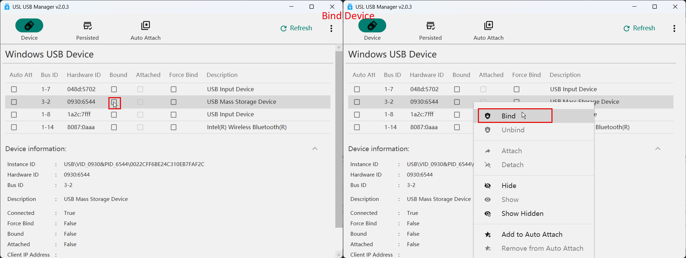
    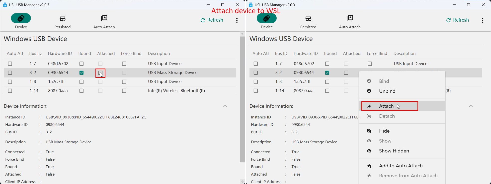
    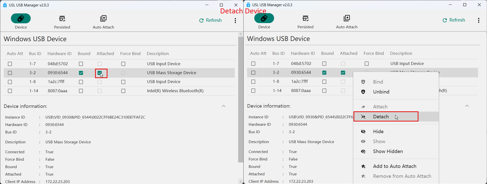
    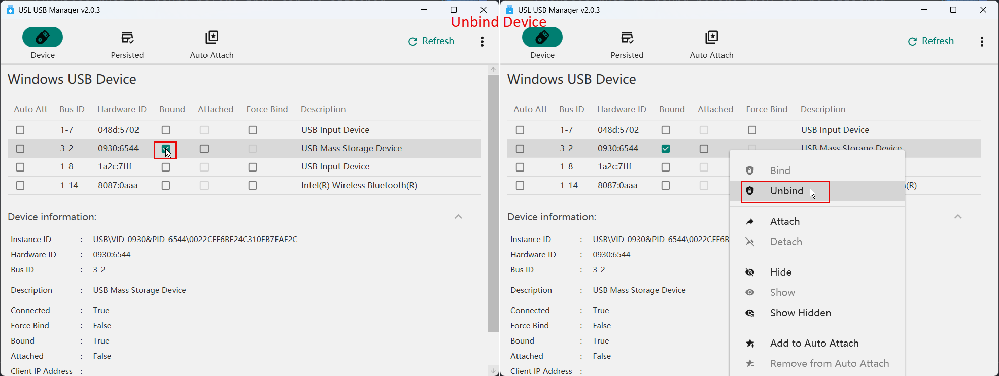

2. Hide or show filtered devices

    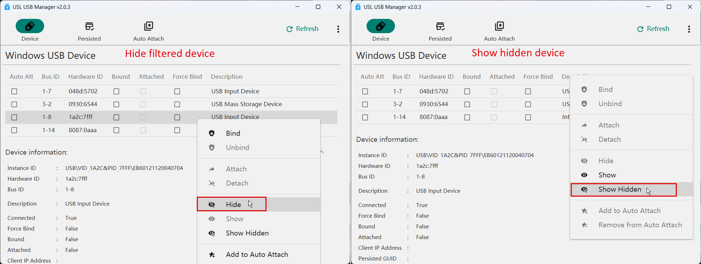

3. Shows detailed information for the selected device

    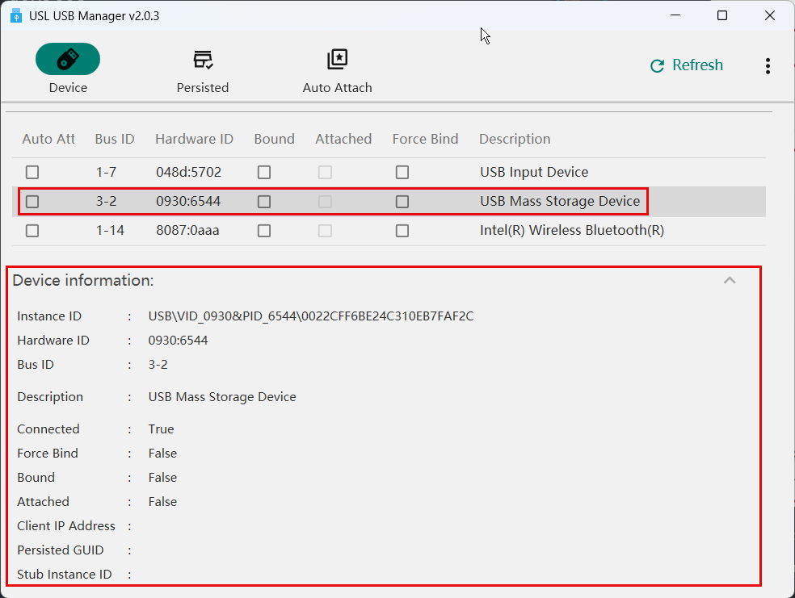

4. Supports attaching USB devices to WSL via a specific network adapter

   On some domain-controlled Windows machines, firewall rules may prevent WSL from accessing host services over non-private networks, which can block device attachment and produce errors like the one below:

   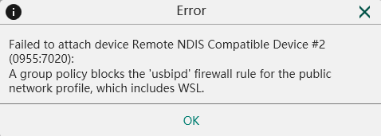

   In such cases, you can mark a network as **Private** and configure the adapter to attach devices via that network. **Note: Do not mark untrusted networks (e.g., public Wi‑Fi) as Private.**

   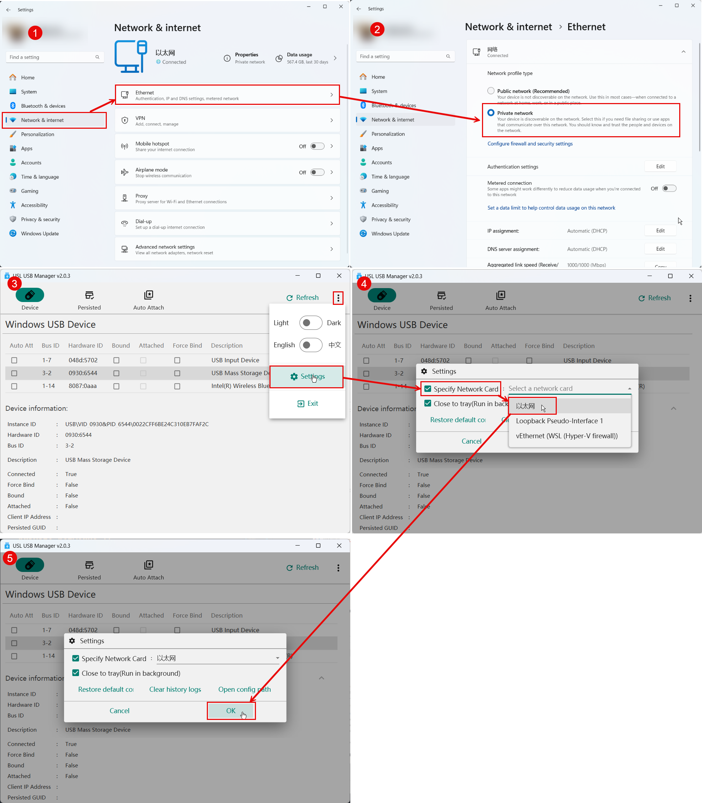

5. Displays persisted devices and allows removing them

    Persisted devices are bound devices that are currently disconnected (not plugged into the host). usbipd-win records bound devices and rebinds them at startup, which can accumulate many persisted entries over time—this app helps you manage them.

    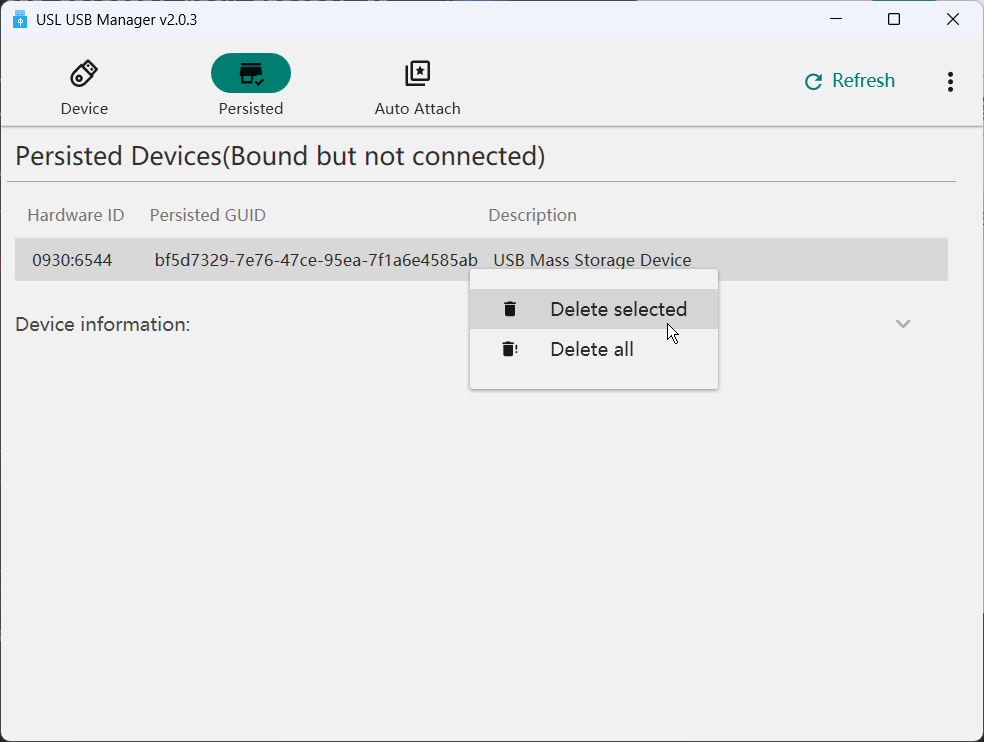

6. Automatically detects USB plug/unplug events and refreshes the device list

7. Auto-attach feature: devices added to the auto-attach list are attached to WSL automatically when plugged in

    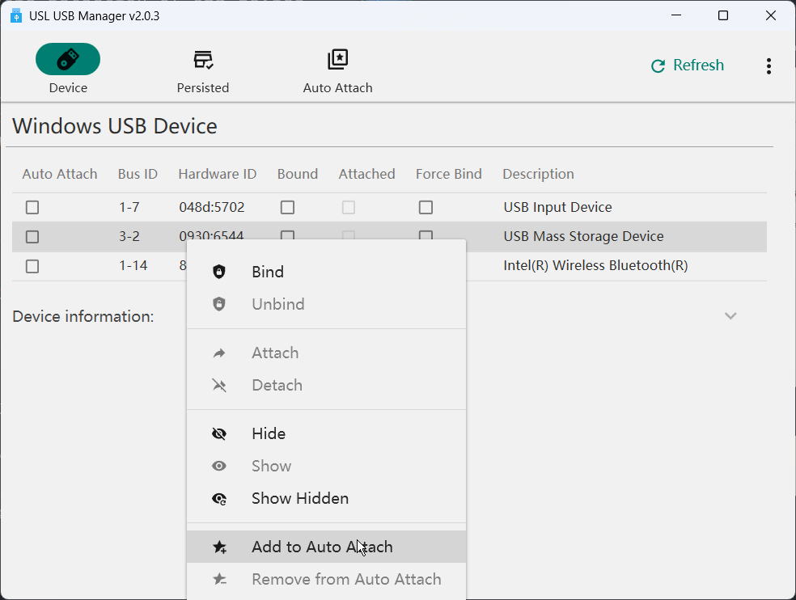

8. Supports Chinese and English languages

    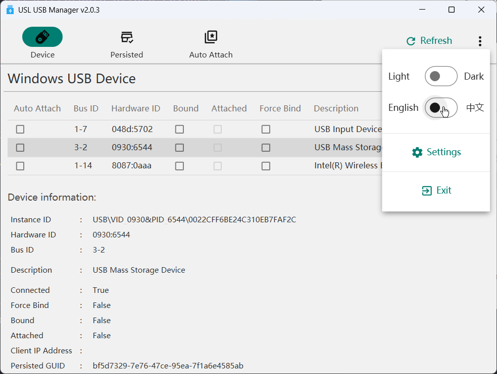

**Requirements**

- Windows 10 or later  
- .NET Framework 4.8  
- usbipd-win v4.4.0 or later  
- The WSL2 distribution must be Debian-based (e.g., Debian or Ubuntu).
- Administrator privileges required to bind devices

#### Building

1. Install Visual Studio 2022 with:

   - License Header Manager  
   - Microsoft Visual Studio Installer Projects 2022

2. Install Git  
3. Install Inno Setup 6 (for building the installer)  
4. Install GitVersion Tool

```powershell
dotnet tool install --global GitVersion.Tool
```

5. Build

```powershell
.\Build.ps1
```

After building, an installer named `WSL USB Manager Vx.x.x.exe` will be generated in `BuildOutput\Installer` (where `x.x.x` is the current version number).

#### Bug Reports

If you encounter issues, open the log folder, copy the latest log file, and submit an issue with the log attached in the repository's Issues page.

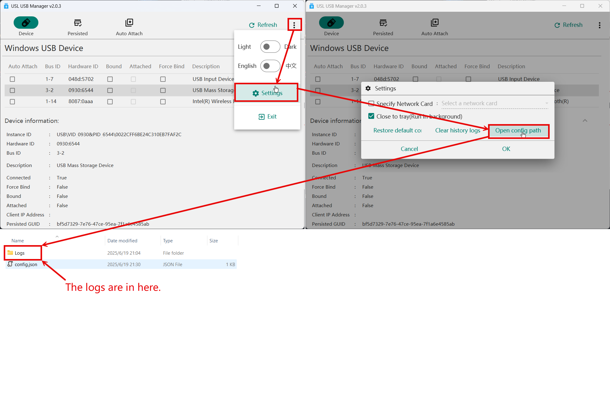
