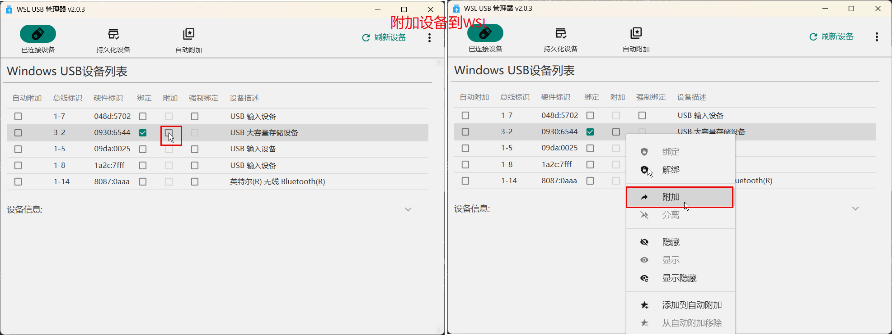

# wsl-usb-manager

#### 介绍

一款配合usbipd-win使用的用于附加USB设备到WSL中的工具，提供友好用户界面。

**功能**

1. 显示所有USB设备列表，可通过复选框或者右键菜单进行绑定设备附加设备等操作
2. 显示已选设备的详细信息
3. 支持自动检测USB设备插拔事件，自动刷新设备列表
4. 支持通过指定网卡附加USB设备到WSL
5. 显示持久化的设备，可删除持久化设备
6. 支持自动附件功能：设备添加到自动附加列表后，当设备插入时自动附加到WSL
7. 支持中英文

**运行需求：**

1. Win10以上版本
2. .Net Framework 4.8环境
2. WSL2环境，需要安装usbipd-win（须为4.4.0或者以上版本）
3. 绑定设备时需要管理员权限

#### 使用方法

**绑定设备**


**附加设备**

>附加设备之前，必须先绑定设备。



**解绑设备**


**分离设备**


**自动附加设备**

设备添加到自动附加设备列表后，当设备插入时，自动附加到WSL。


对于某些被组织域管控的windows，可能有特殊的防火墙配置，不允许WSL通过非私有网络访问host机上服务，这样导致设备无法被附加到WSL中。此时可以将设备上某个网络设置为私有网路，并且设置通过该网卡附加设备。注意：请不要将非安全网络（例如公共场所的WiFi网络）设置为私有网络。


#### 构建

1.  安装Visual Studio 2022，同时安装如下扩展：

    - License Header Manager
    - Microsoft Visual Studio Installer Projects 2022

2.  安装Git Version

    ```powershell
    dotnet tool install --global GitVersion.Tool
    ```

3.  构建

    ```powershell
    .\buid_installer.ps1
    ```

    构建完成后，会在`Installer\Release\`生成一个名为`WSL-USB-Manager-vx.x.x.msi`的安装包，其中vx.x.x为当前版本号。


#### 报告bug

如果您在使用中遇到问题，请按照如下步骤打开日志路径，拷贝出最新日志，并在`issue`中提交bug同时附加日志。


]
