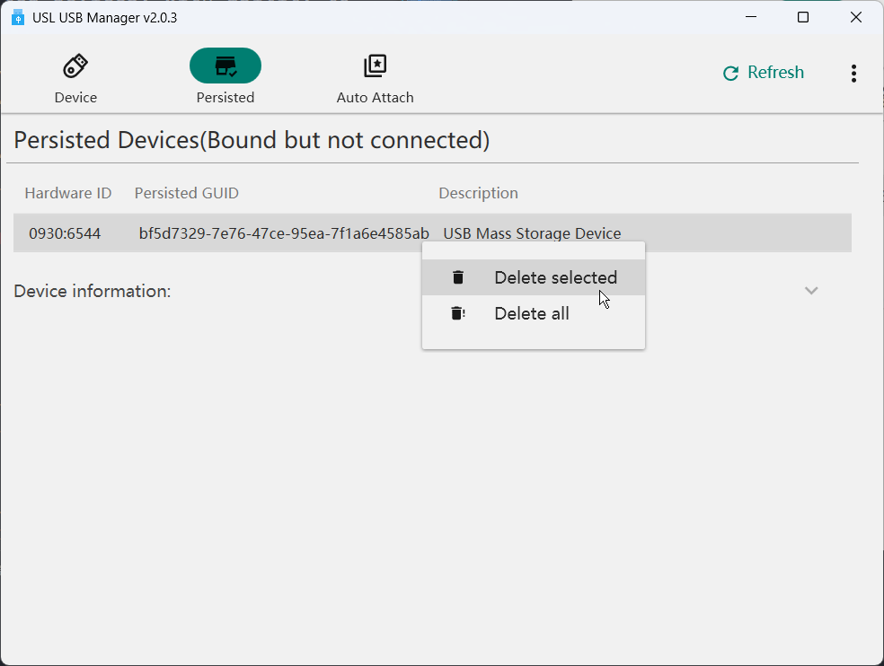

# wsl-usb-manager

#### Introduction

A tool that works with usbipd-win to attach USB devices to WSL, providing a friendly user interface.

**Features**

1. Display a list of all USB devices, bind/unbind devices, attach/detach devices through checkboxes or right-click menu.

    >Devices must be bound before they can be attached.

    
    
    
    ]

2. Hide/Show filtered devices

    

3. Display detailed information of selected devices

    

4. Support attaching USB devices to WSL through specified network adapter

   For some Windows machines controlled by organizational domains, there might be special firewall configurations that don't allow WSL to access host services through non-private networks. This prevents devices from being attached to WSL, and the program will report errors similar to the one shown below:

   

   In this case, you can set a network as private and configure to attach devices through that network adapter. **Note: Do not set unsecure networks (like public WiFi) as private networks.**

   

5. Display persisted devices, with ability to remove them

    Persisted devices are those that are bound but not connected (not plugged into the host).
    usbipd-win records bound devices after each binding and automatically binds them on next startup.
    This can result in many persisted devices, which can be managed by this program.

    

6. Support automatic detection of USB device plug/unplug events, automatically refreshing the device list

7. Support auto-attach feature: devices added to the auto-attach list will be automatically attached to WSL when plugged in

    

8. Support Chinese and English languages

    

**Requirements**

1. Windows 10 or above
2. .Net Framework 4.8 environment
3. usbipd-win v4.4.0 or above
4. WSL2 environment with usbipd-win installed
5. Administrator privileges required for binding devices

#### Building

1.  Install Visual Studio 2022 with the following extensions:

    - License Header Manager
    - Microsoft Visual Studio Installer Projects 2022
2.  Install Git
3.  Install Inno Setup 6 (for building installer)
4.  Install Git Version

    ```powershell
    dotnet tool install --global GitVersion.Tool
    ```

5.  Build

    ```powershell
    .\Build.ps1
    ```

    After building, an installer named `WSL USB Manager Vx.x.x.exe` will be generated in `BuildOutput\Installer`, where `x.x.x` is the current version number.


#### Bug Reports

If you encounter any issues while using the program, please follow these steps to access the log path, copy the latest log, and submit a bug report in the `issue` section with the log attached.


